> [!tldr]
> **Terraform** is a tool for building, changing, and versioning infrastructure safely

- enables application software best practices to infrastructure
- compatible with many clouds and services
- [[Terraform state file]]
## Architecture

```mermaid
graph LR
	A[📄 Terraform State] <--> C[Terraform Core]
	B[⚙️ Terraform Config] --> C
	C <--> D[AWS Provider]
	C <--> E[Cloudflare Provider]
	D <--> F[AWS]
	E <--> G[Cloudlfare]
```

## Basic Usage Sequence

> [!example] Sequence
> - terraform init
> - terraform plan
> - terraform apply
> - terraform destroy

## Common patterns

> [!example] Common Patterns
> - terraform for provisioning, [[Ansible]] for config management
> 	- terraform for vm, ansible for install necessary dependencies
> - terraform for provisioning, [[packer]] for server templating
> 	- build images for VM creation , copy self with terraform
> - terraform for provisioning, [[kubernetes]] for orchestration
> 	- terraform defines cloud resources, kubernets define how application to deployed or managed in those resources